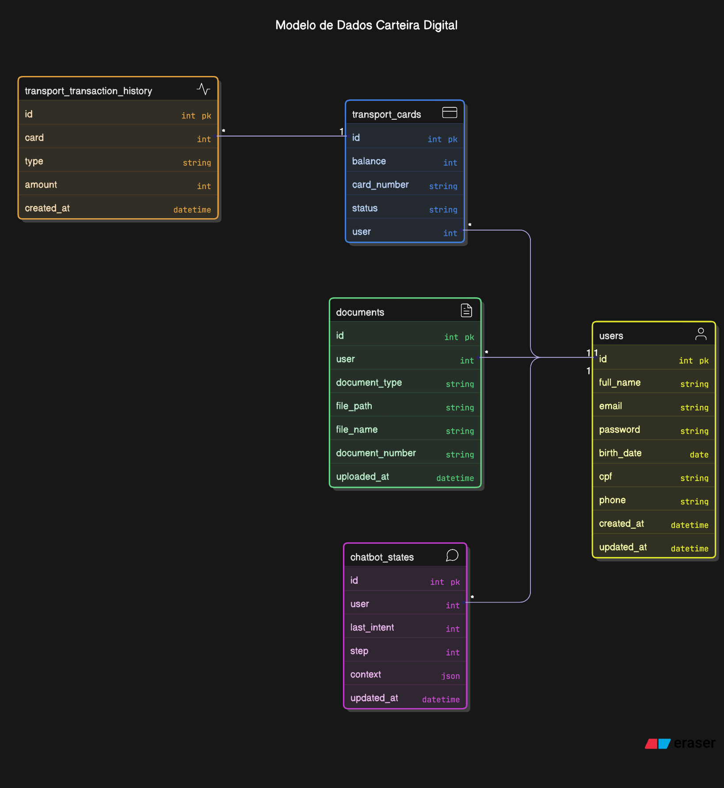
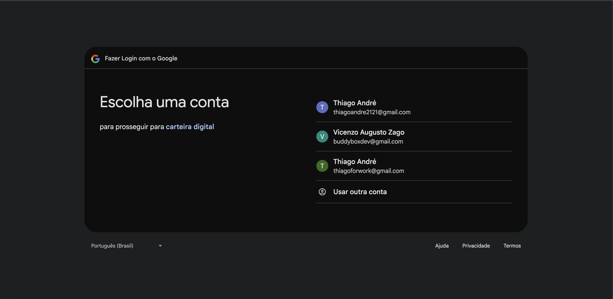
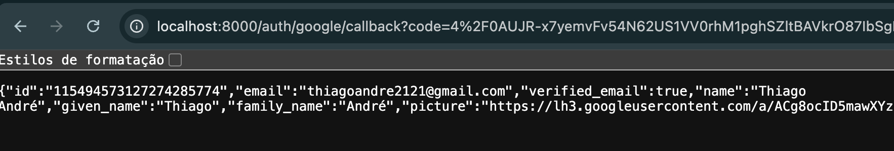
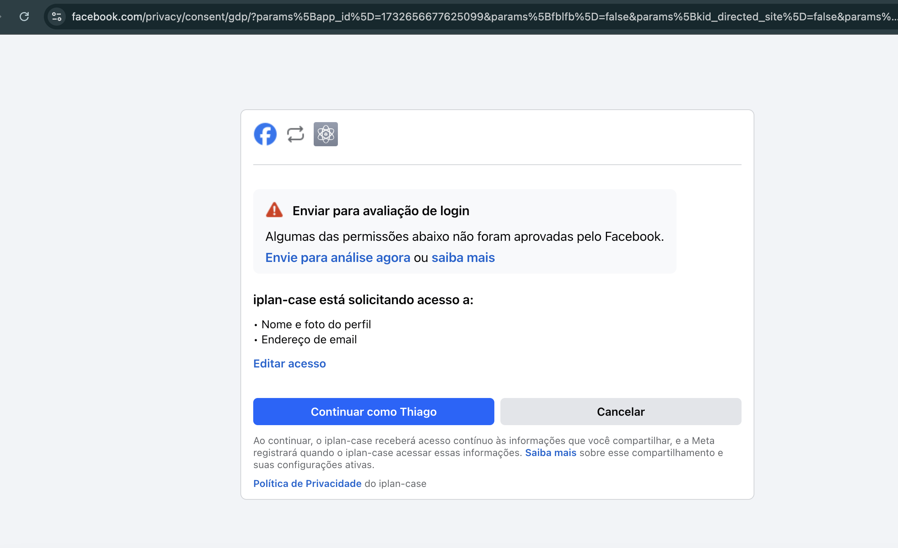
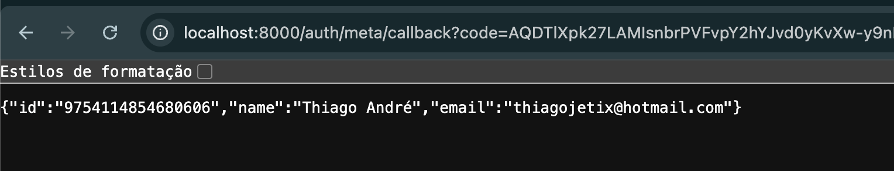
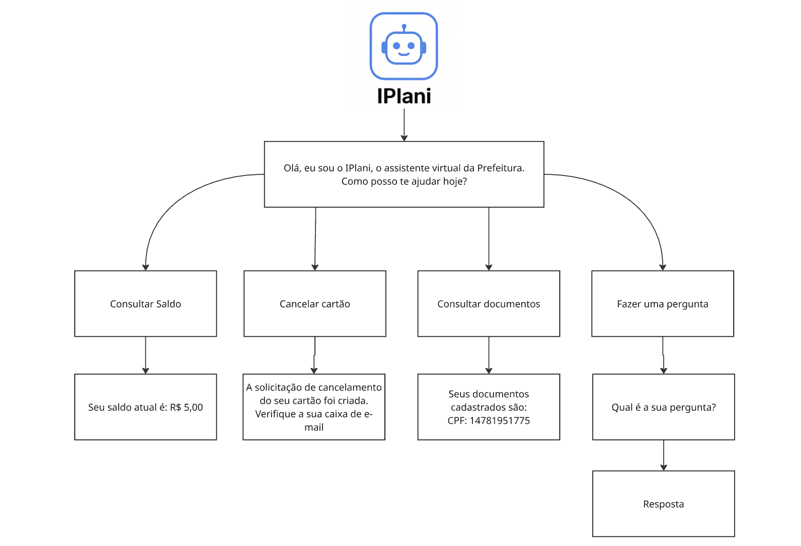
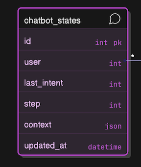

# Desafio Técnico – Desenvolvedor(a) Back-end Sênior

Bem-vindo(a) ao desafio técnico para a vaga de Pessoa Desenvolvedora Back-end Sênior!

Neste README estão detalhadas todas as informações sobre a minha implementação do desafio

## 📌 Contexto

A Prefeitura do Rio de Janeiro quer oferecer aos cidadãos uma **API de Carteira Digital**, onde os usuários poderão armazenar e gerenciar documentos digitais, consultar e carregar créditos do transporte público e acessar serviços municipais via chatbot.

O desafio é desenvolver uma API para essa carteira digital, simulando as interações do usuário com documentos e transporte público.

## Prévia
Antes de realizar as etapas para rodar o projeto, você pode visualizar a API que está disponível publicamente em:

[https://api.iplan.thiagoandre.dev.br/docs](https://api.iplan.thiagoandre.dev.br/docs)
## Rodando o projeto
### Requisitos
 - Docker instalado
### Passo a passo
1) Clone o repo
```console
git clone https://github.com/thiago1591/desafio-senior-backend-developer
```
2) Vá até a pasta do projeto
```console
cd desafio-senior-backend-developer
```

3) Crie o .env

Crie um arquivo .env na raiz do projeto e copie para ele, o conteúdo do .env.example

4) Suba o docker
```console
docker-compose -f docker-compose.dev.yml up --build
```
Aguarde aparecer a mensagem `INFO:     Application startup complete.`

Esse comando irá subir o Postgres, a API e o Jaeger (que será explicado mais adiante)

A API estará disponível localmente na porta **8000**


## Documentação
A API está documentada no Swagger, acessando a rota [/docs](http://localhost:8000/docs)

Nela é possível ver em detalhes todos os endpoints disponíveis, assim como os schemas.

## Estrutura do projeto
```
desafio-senior-backend-developer
├── .github
│   ├── workflows
│   │   ├── ci.yml
├── src
│   ├── user
│   │   ├── router.py
│   │   ├── schemas.py 
│   │   ├── models.py 
│   │   ├── dependencies.py
│   │   ├── config.py 
│   │   ├── exceptions.py
│   │   ├── service.py
│   │   └── utils.py
│   ├── ... (outros módulos)
│   ├── config.py  
│   ├── models.py 
│   ├── database.py  
│   └── main.py
├── tests/
├── requirements
├── .env
├── .gitignore
...
```
A estrutura do projeto segue uma arquitetura modular, onde cada módulo tem algumas camadas. Elas serão explicadas na próxima seção

## Camadas do módulo
   1. `router.py` - é o núcleo de cada módulo com todos os endpoints
   2. `schemas.py` - para os modelos Pydantic (define e valida os dados recebidos e retornados)
   3. `models.py` - modelos do banco de dados
   4. `service.py` - aqui estão as regras de negócio
   5. `dependencies.py` - dependencias do router
   8. `utils.py` - funções de utilitários
   9. `exceptions.py` - excessões específicas do módulo, ex: `DocumentNotFound`

## Entidade Relacionamento



## Testes
Os testes estão no diretórios `tests` na raiz do projeto. Estão implementados tanto testes de unidade quanto teste de integração.

O objetivo dos testes de unidade é testar a regra de negócio de forma completamente isolada. É possível testar cenários específicos, como o caso do teste `test_multiple_recharges_accumulates_correctly` em que é testado várias recargas no cartão de transporte em sequência e verificado se a soma é acumulada corretamente.

Os testes de integração, por outro lado, testam um cenário mais realista. O service não é testado isolado, mas sim junto com a rota e o banco de dados. Foi utilizado o SQlite como banco fake para realização dos testes de integração.

Os testes são executados automaticamente ao enviar um push. Se você quiser rodar manualmente, é necessário rodar os testes de integração separado dos de unidade. 
A variável TESTING=1 serve para impedir que o banco real Postgres inicialize

```console
docker exec -it desafio-senior-backend-developer-api-1 pytest -m unit
```
```console
docker exec -it desafio-senior-backend-developer-api-1 sh -c "TESTING=1 pytest -m integration"
```

```
├── tests
│   ├── integration
│   │   ├── test_auth.py
│   │   ├── test_documents.py
│   │   ├── test_transport.py
│   │   ├── test_users.py
│   ├── unit
│   │   ├── documents
│   │   │   ├── test_documents_service.py  
│   │   ├── transport
│   │   │   ├── test_transport_service.py
│   │   ├── user
│   │   │   ├── test_user_service.py

```
Foram criados 19 testes unitários e e 18 testes de integração, totalizando 37 testes, que cobrem todas as funcionalidades exceto o chabot. Os testes testam tanto o caminho feliz quanto caminhos secundários.

## 🔹 Funcionalidades

- Autenticação e Gerenciamento de Usuários
    - Cadastro e login de usuários (simples, com e-mail/senha).
    - Uso de tokens JWT para autenticação.
    - Autenticação com o Google
    - Autenticação com o Meta
    - CRUD de usuários

- Gestão de Documentos
    - Endpoints para armazenar, listar, atualizar e deletar documentos digitais (exemplo: identidade, CPF, comprovante de vacinação).

- Gestão de Transporte Público
    - Endpoint para buscar os meus cartões de transporte público
    - Endpoint para consultar saldo do passe de transporte público
    - Endpoint para simular recarga e débido do passe
    - Endpoint para ver o histórico de transações

- Integração com Chatbot (Simples)
    - Consultar o saldo do passe pelo bot
    - Ver os meus documentos pelo bot
    - Fazer uma pergunta livre (resposta de perguntas mokadas)
    - Cancelar Cartão (simulado, apenas diz que criou uma solicitação de cancelamento)
    - Salvar documento (iniciado mas não finalizado)

## OAuth2
Além da autenticação padrão com JWT, o sistema também possui opções de autenticação com o Google e Meta. 

Para testar o OAuth2 social, é necessário preencher os valores do .env referente ao Google e Meta com valores reais. Durante o desenvolvimento do case, criei um projeto/app no Google/Meta para obter as credenciais. Mas mesmo que eu colocasse minhas credenciais no example, outras pessoas não conseguiriam testar o OAuth, pois como não está em produção, eu precisaria adicionar o email do testador no painel, senão daria "App não disponível". Por esse motivo, estou colocando prints abaixo mostrando o funcionamento.

Para usar o OAuth do google, é necessário acessar a rota diretamente do navegador (Swagger não tem redirect)
`http://localhost:8000/auth/google/login`

O resultado é a tela abaixo:



Após selecionar a conta, leva para a rota de redirect (é um endpoint da API)



Abaixo está o fluxo semelhante para o Meta




No endpoint de callback, eu estou apenas retornando as informações obtidas, para verificar o funcionamento do OAuth.
Como nesse sistema a autenticação é com CPF e ele é obrigatório, em um fluxo real do frontend, o usuário ainda precisaria ir para outra 
página para terminar o cadastro. Por conta disso, não estou criando a conta do usuário direto no endpoint de callback (por ainda não ter todas as informações necessárias)

## Rota de  Saúde
é possível testar se a API está rodando chamando o endpoint [/health](http://localhost:8000/health)

## Bot
Abaixo está um diagrama que mostra em mais detalhes as funcionalidades do bot



Explicando mais tecnicamente, o bot tem 2 endpoints disponíveis:
 - /chatbot/start
 - /chatbot/chat

O endpoint /chatbot/start é usado apenas para listar a lista de opções do bot na primeira mensagem. É importante pois o segundo endpoint, supoe que o usuário já escolheu o número de uma opção disponível.

O endpoint  /chatbot/chat recebe o token (com o user_id) e o input do usuário. Nas etapas principais, o input do usuário será um número com a opção. 
Nesse momento, será chamada a camada de intent_dispatcher com o estado atual (que será criado se ainda não existir) e o input do usuário. Essa camada será responsável por direcionar o fluxo para a intenção correspondente do usuário.

Mas o que é o estado atual? 

Foi criada uma tabela chamada `chatbot_states`. 



O objetivo dessa tabela, é permitir que o sistema crie uma máquina de estados, de forma que, quando o usuário interagir, o sistema "lembre" em que parte do fluxo ele está.

Por exemplo. Se o usuário quer consultar o saldo, ele digita a opção correspondente e recebe o saldo. Nesse caso o fluxo não tem mais de 1 interação, então não precisa salvar o estado.

Por outro lado, se o usuário quer fazer uma pergunta geral, ele primeiro precisa enviar uma mensagem com numero 5, para indicar que quer fazer uma pergunta. Após isso, o bot irá pedir para o usuário digitar a pergunta e ele irá enviar outra requisição com a pergunta. Nesse caso, é preciso ter um estado salvo para "lembrar" que a última interação foi o usuário escolhendo que quer fazer uma pergunta e que o fluxo atual está recebendo a pergunta. 

O mesmo aconteceria para o fluxo de salvar documentos, que precisaria perguntar as informações do documento para então salvar no final (implementação disso não foi finalizada mas a tabela de estados já permitiria implementar)

```
├── chatbot
│   ├── services
│   │   │   intent_handlers
│   │   │   ├── handle_cancel_card.py
│   │   │   ├── handle_check_balance.py
│   │   │   ├── handle_find_my_documents.py
│   │   │   ├── handle_question.py
│   │   │   ├── handle_save_document.py #não finalizado
│   │   ├── intent_dispatcher.py
│   ├── router.py
│   ├── models.py
│   ├── state_manager.py
│   ├── ...
```

## Separação dos ambientes
O projeto possui 2 ambientes: dev e prod. Foram criados 2 Dockerfiles e 2 Docker Composes. Nesse README, os comandos já instruem para rodar corretamente o ambiente de dev, para testar localmente. As configurações de produção foram utilizadas no deploy do projeto, que serão discutidas mais detalhadamente da seção de discussões de decisões.

## CI/CD
Em .github->workflows->ci.yml
está o arquivo da pipeline. Nela, está configurado para executar o github actions com os testes. Sempre que é enviado um novo push, garantindo que novas alterações não quebrem funcionalidades existentes.

## Logging
na pasta src, existe um módulo dedicado ao logging. Nele, está configurado apenas o log padrão do Python. Contudo, essa abstração é importante pois, caso fosse necessário implementar alguma ferramenta de logging (como por exemplo o Loki), então bastaria implementar nesse módulo e todo restante do código iria funcionar da mesma forma. 

Os logs são uma ferramenta bem importante de estar configurada pois facilita a depuração e correção de problemas que são encontrados em produção. O ideal é que já sejam configurados desde as etapas iniciais de uma API, por esse motivo coloquei esse esboço. 

No endpoint de criação de usuário, eu coloquei alguns logs para mostrar como seria o funcionamento

## Tracing
O tracing é outra ferramenta de observabilidade, para complementar os logs. Ele permite rastrear o fluxo de execução de uma requisição ao longo de diferentes partes do sistema, assim como o tempo de execução em cada uma dessas partes. Eu usei o `OpenTelemetry` e implementei um exemplo, também no endpoint de criação de usuário. 

No Docker Compose, adicionei um serviço do Jaeger. É possível acessar em 

http://localhost:16686

Esse painel já possui algumas ferramentas de observabilidade

## Migrações

Para gerenciamento das migrações, estou usando o [Aerich](https://tortoise-orm.readthedocs.io/en/latest/migration.html).

O histórico de migrações fica na pasta `/migrations`, na raiz do projeto.

### Criar uma nova migração

Para criar uma nova migração após modificar os modelos, rode o seguinte comando:

```bash
docker compose exec desafio-senior-backend-developer-api-1 aerich migrate
```
Sempre que o container do Docker sobe, ele já roda `aerich upgrade`

## 🔹 Tecnologias

- FastAPI como framework principal.
- Banco de Dados PostgreSQL 
- ORM Tortoise-ORM
- Ferramenta de migrations Aerich
- PyTest
- OpenAPI para Documentação da API
- GitHub Actions
- Docker
- OpenTelemetry
- Jaeger

## 🔹 Discussão de decisões

### Escolha das tecnologias
O banco de dados escolhido foi o Postgres. Para o escopo dessa API, a escolha entre o MySQL e Postgres não traria mudanças significativas. Optei pelo Postgres pois é o banco que tenho maior preferência, após realizar um estudo de comparação entre esses 2 bancos, para escrita de um artigo durante a disciplina de Administração de Banco de Dados, na faculdade.
As outras tecnologias usadas foram escolhidas baseadas no que eu tenho mais familiaridade.

### Arquitetura em módulos
Como esse é um projeto simples, talvez não fosse necessário o uso de uma arquitetura modular. Porém, decidi aqui aplicar uma organização que eu usaria para um projeto real. No passado, já tive problemas para manter projetos que não usavam módulos (imagine mais de 80 cruds em uma pasta cruds). Por isso hoje eu sempre utilizo uma abordagem modular. Como é simples de entender a aplicar, faz sentido até mesmo para projetos menores, pois também garante que se um dia precisar, será possível escalar.

### Separação das camadas dos módulos
A separação das camadas, que foi descrita na seção "Camadas do módulo", é algo que funciona muito bem e possui diversas vantagens. É algo que é um padrão usado em diferentes linguagens. Por exemplo, o NestJS (framework backend de Javascript) possui outros termos e nomenclaturas, mas segue uma ideia bem parecida.
Uma camada é responsável por validar e tipar os dados de entrada e saída. Outra define as rotas dos endpoints. Outra define as regras de negócio. Outra define a modelagem da tabela e permite a conexão com o ORM.
As principais vantagens são:
 - 1) manutenabilidade: Abrindo o arquivo de routes, é possível ter uma visão geral e legível das rotas usadas no módulo. Após encontrar a rota que quer da manutenção, é possível facilmente encontrar o service correspondente. Como os arquivos estão em um módulo, não é preciso ficar procurando, por exemplo, o arquivo de service dentro de uma pasta como vários services.
 - 2) testabilidade: separando as responsabilidades em diferentes camadas, fica mais fácil de testar. Por exemplo, é possível criar testes de unidade de forma isolada para os services, pois eles estão separados e não acoplados com as rotas.
 - 3) validações: ter uma camada específica para aplicar validações é muito vantajoso pois não é preciso validar tudo no service. Fica mais fácil de adicionar mais validações, deixando o sistema mais seguro sem prejudicar a legibilidade.

 ### Decisões na modelagem
1) Na modelagem da tabela de Document, supus que todo documento pertence a um único usuário (1:N), por conta disso, criei uma tabela do document com user_id em vez de uma tabela de document e outra user_documents.
2) Decidi modelar a tabela de Document de forma mais simples e genérica dado o escopo desse desafio, mas em um cenário real é possível que os diferentes tipos de documentos tivessem necessidade de campos adicionais
3) Decidi separar o cartão de transporte em uma tabela separada em vez de considerar como um documento na tabela de documentos pois existiria a possibilidade de o cartão de transporte ter mais atributos e funcionalidades específicas no futuro
4) Decidi salvar o saldo como centavos (tipo int) pois é uma boa prática para evitar problemas de arredondamentos em alguams linguagens 

### Sobre a recuperação de senha
Decidi criar um módulo separado para a recuperação de senha pois é o que eu faria em uma API real. Criei alguns endpoints para simular como seria o fluxo e coloquei um comentário onde seria a comunicação com o serviço externo (SMS ou Email) para envio do código de recuperação. Por conta do tempo acabei não finalizando essa módulo. 

### Consideração sobre o login
Nesse projeto, decidi que o login seria feito por CPF, por se tratar de um gerenciamento de documentos em um sistema de serviço público. Contudo, na interface do Swagger, para funcionar o OAuth através do botão no canto direito superior da página, é necessário que o nome dos parâmetros do login sejam "username" e "password". Por esse motivo talvez acabe gerando um pequena confusão, pois não fica tão claro que deve ser inserido o CPF.

### ChatBOT
A funcionalidade do chatbot acredito que seja a funcionalidade desse desafio que poderia seguir diferentes caminhos. Eu achei que seria legal para o contexto desse desafio, usar o chatbot para realizar algumas das funcionalidades dos outros módulos (como consultar saldo). Também coloquei opção para ele responder uma pergunta qualquer, que é a funcionalidade principal requerida no desafio. 
O bot responde perguntas verificando diretamente das perguntas existentes (que estão mokadas). Para uma funcionaldiade real, daria pra usar um banco de dados vetorial para armazenar diferentes perguntas e respostas. Quando o usuário fizesse uma nova pergunta, verificaria a similaridade no espaço vetorial para buscar a resposta mais relevante. Também daria pra usar isso em conjunto com um LLM para passar as respostas mais similares para o contexto do LLM e responder uma resposta ainda mais precisa (técnica de RAG). É algo que eu implementei no meu TCC.

### Deploy
Como eu já tinha um domínio e uma máquina rodando na AWS, decidi fazer o deploy da API apenas como um extra, para ter um ambiente em produção real.
O que eu fiz foi:
 - usei uma instância EC2
 - clonei o repo na máquina
 - rodei o docker de produção e configurei o env
 - cadastrei o subdomínio api.iplan.thiagoandre.dev no registrobr
 - usei o certbot para obter os certificados https do subdomínio
 - configurei o nginx

### Observabilidade
Decidi implementar um esboço de observabilidade hoje eu costumo implementar ao iniciar APIs. É muito comum finalizar um sistema, ir para produção, aparecerem problemas e os usuários não saberem explicar muito bem qual é o problema, muito menos como reproduzir. A observabilidade resolve isso pois permite identificar em tempo real, o que economiza bastante tempo que seria basta tendo que debugar o código para tentar entender o que ocorreu.